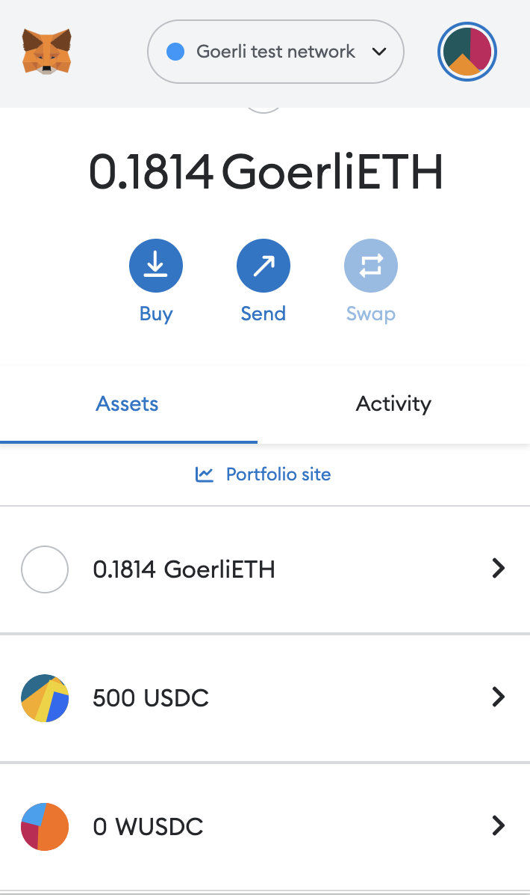

# Nivaura Demo

## General User Stories

1. As a client I want to enter the Pairwyse website and be able to create an Agreement Tranches smart contract (AT) that would allow the user to deposit USDC tokens into Compound V2.
2. As a client I want to specify the Deposits Deadline and Lock Time variables for AT contract.
3. As a user I want to enter the deployed AT contract by providing USDC to it.
4. As anyone I want to trigger depositing my USDC to Compound V2 from AT contract after the Deposits Deadline has passed.
5. As a user I want to withdraw my funds (body; without the interest) from AT contract after the Deposits Deadline + Lock Time has passed.

## Deployments to Goerli

For commit with ID 95709a7f291ce61541bc78189e906ae73c2ffe53

- StringStack [0x2cD6BeBf36BC7eCf3B5303B033FCd0cce28653C9](https://goerli.etherscan.io/address/0x2cD6BeBf36BC7eCf3B5303B033FCd0cce28653C9#code)
- StringUtils [0xD816C20e28Cc704028c475108f4DC535e237EbD9](https://goerli.etherscan.io/address/0xD816C20e28Cc704028c475108f4DC535e237EbD9#code)
- Preprocessor address [0x43cF86ea1eC36C023d5d0E801dD8C459AC456947](https://goerli.etherscan.io/address/0x43cF86ea1eC36C023d5d0E801dD8C459AC456947#code)
- OpcodeHelpers [0x088890626B062e1E7De8f13d49c72bDCB93066b0](https://goerli.etherscan.io/address/0x088890626B062e1E7De8f13d49c72bDCB93066b0#code)
- ComparisonOpcodes [0x62Ab7De53EF4bFfAB0133dea58EF3C1d202D894e](https://goerli.etherscan.io/address/0x62Ab7De53EF4bFfAB0133dea58EF3C1d202D894e#code)
- BranchingOpcodes [0xC0e037AC5F7181b3f28B939301860e74AFd4A265](https://goerli.etherscan.io/address/0xC0e037AC5F7181b3f28B939301860e74AFd4A265#code)
- LogicalOpcodes [0xcd6037cDC0166E7735d6AB1819688050F186692c](https://goerli.etherscan.io/address/0xcd6037cDC0166E7735d6AB1819688050F186692c#code)
- OtherOpcodes [0xDC246FA53Bc64B05ed639Cf90cD5640876F80D3A](https://goerli.etherscan.io/address/0xDC246FA53Bc64B05ed639Cf90cD5640876F80D3A#code)
- DSLContext [0x20FE732B7A4BCA0f637d459ee53f4B2Cf46583fF](https://goerli.etherscan.io/address/0x20FE732B7A4BCA0f637d459ee53f4B2Cf46583fF#code)
- ByteUtils [0x1C407CDD4975532Bb5f3f614FB3b48478f597f49](https://goerli.etherscan.io/address/0x1C407CDD4975532Bb5f3f614FB3b48478f597f49#code)
- Parser [0x4827b97709B2E8cf1F53Da11f7Fb069CD18F739d](https://goerli.etherscan.io/address/0x4827b97709B2E8cf1F53Da11f7Fb069CD18F739d#code)
- Executor [0x69D4725cc55980416bA5AEd6EC565547D281c8F9](https://goerli.etherscan.io/address/0x69D4725cc55980416bA5AEd6EC565547D281c8F9#code)

## Prerequisites

1. Connect to Pritunl using the instuctions [in the Confluence](https://consideritdone.atlassian.net/wiki/spaces/AKIVA/pages/2462810127/devops+How+to+connect+a+client+to+the+open-source+Pritunl+VPN).
2. Open your browser with MetaMask and navigate to [https://dsl.qa.akiva.capital/](https://dsl.qa.akiva.capital/)
3. Authorize the website with a MetaMask address (creator) that has enough GETH and make sure MetaMask is connected to the Goerli network.
4. Prepare another MetaMask address (investor) with some GETH (about 0.2 GETH) and 100 Goerli USDC (or more)

Note: to receive GETH you may use one of the available GETH Faucets like https://goerlifaucet.com/

Note: to receive Goerli USDC you must use the USDC Faucet contract located at [0x75442Ac771a7243433e033F3F8EaB2631e22938f](https://goerli.etherscan.io/address/0x75442ac771a7243433e033f3f8eab2631e22938f#writeContract) and call the `drip` function.

## Front End interactions

### Create and Setup MultiTranche Agreement

1. Click on the `Agreement Interaction` button, and you will be redirected to Agreement `Creation` tab.
   
2. On this tab from the dropdown menu select the "MultiTranche" option and hit the `Create Agreement` button. After this, you will have many MetaMask prompts to send transactions (about 7-10 transactions). Make sure you confirm all of the transactions.
   
3. After the MultiTranche contract is deployed copy and write down its address (you will see a MultiTranche address in the notification on the right of the screen).
   
4. Define a variable `DEPOSITS_DEADLINE` of type "number" with a timestamp in seconds of any time in the future. This variable controls the deadline to control.
      

   Note: For demo purposes, the best option for the deadline would be about 3 minutes ahead of the current block timestamp. You may use the [https://www.unixtimestamp.com/](https://www.unixtimestamp.com/) website to find the timestamp of any given time. Make sure that your timestamp is in UTC

      

      

5. (optional) Define a `LOCK_TIME` variable. This variable controls how long the user cannot withdraw his/her USDC. Set this variable to any positive number (in seconds) to lock the withdrawal.

### Interact with MultiTranche Contract

1. Connect to the website with the investor's address.
2. Navigate to MultiTranche contract on Goerli, call WUSDC() function to obtain the WUSDC address, and write it down. You may check [this contract](https://goerli.etherscan.io/address/0xd06B2f1fA0D60148a5E97E6D230f14426e3587Ed#readContract) as an example.
   
3. Add the WUSDC token to the investor's MetaMask wallet by its address (from the previous step). Your balance should be 0 WUSDC.
   
4. Open a [Goerli USDC smart contract](https://goerli.etherscan.io/token/0x07865c6E87B9F70255377e024ace6630C1Eaa37F?a=0x127a009e97644e25f4f5f3cb37e5c78bcf5f4c34#writeProxyContract) in Goerli block explorer. Use the `approve` function to approve 100 USDC (100000000 – with decimals) to be spent by MultiTranche contract address.
   

5. Note your USDC balance. It should be greater than 100 USDC. Now go back to the Pairwyse DSL website navigate to the `Execution` tab, select `1` in the `ID` dropdown (this is record #1), and hit the `Execute` button. After the transaction is confirmed, your WUSDC balance (you may check in MetaMask) should be 100 WUSDC, while your USDC balance should be decreased by 100 USDC.

   

   
    
   

   

   Note: if the transaction fails, make sure that the deadline that you have set is still some time in the future.
   

6. After the deadline is in the past – execute record #2. To do that, you should use the same `Execution` tab, select `2` from the `ID` dropdown, and hit the `Execute` button.
   
7. If you have set a `LOCK_TIME` variable to a non-zero value, wait until the lock time has passed.
8. Open a Goerli WUSDC smart contract in [Goerli block explorer](https://goerli.etherscan.io/) by searching the contract by its address. Use the `approve` function to approve 100 WUSDC to be spent by MultiTranche contract address.
   
9. Note your WUSDC and USDC balances in MetaMask. After record #3 is executed these token balances will change. On the `Execution` screen execute record #3. After the transaction is confirmed, the investor's USDC balance should be increased by 100 USDC. The WUSDC balance should become 0 WUSDC.
   
   

   
    
   

10. You have received all your USDC back. The Demo is completed!
