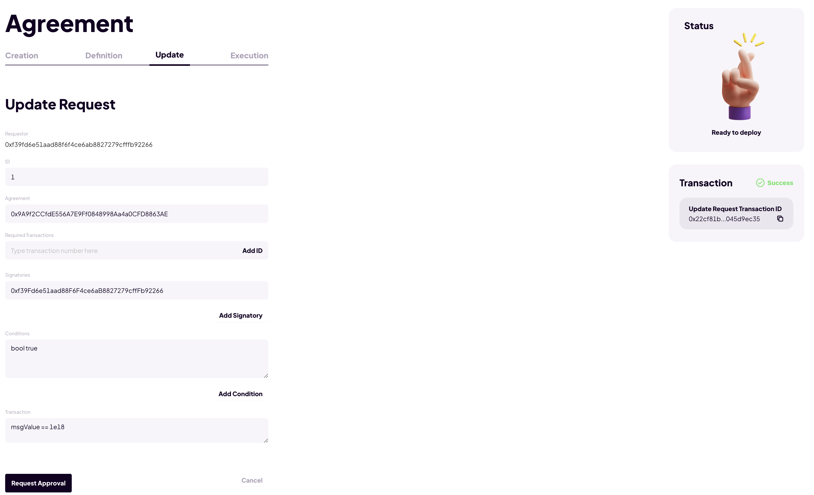

# Agreement Transferring Funds Demo

## Steps to reproduce

### Setup Solidity SC

1. Open a new terminal window.
2. `git clone https://github.com/akiva-capital-holdings/solidity-dsl.git`
3. `cd solidity-dsl`
4. `git checkout f6ca4e7f580bc97bf07f6d3dbc9fd3c31f20de96`
5. `yarn`
6. In one terminal window: `npx hardhat node`
7. In another terminal window: `npx hardhat run --network localhost scripts/deploy.agreementFactory.ts`. Remember AgreementFactory address
8. In another terminal window: `npx hardhat run --network localhost scripts/deploy.parser.ts`. Remember Parser address
9. In another terminal window: `npx hardhat run --network localhost scripts/deploy.contextFactory.ts`. Remember ContextFactory address

### Setup FE

1. Open a new terminal window.
2. `git clone https://github.com/akiva-capital-holdings/dsl-fe.git`
3. `cd dsl-fe`
4. `git checkout f57151d8bd5476c75a0dc920f2edafedcada7073`
5. `yarn`
6. Modify `.env.locale`:
   - Set `REACT_APP_AGREEMENT_FACTORY` to AgreementFactory address that you've remembered
   - Set `REACT_APP_PARSER` to Parser address that you've remembered
   - Set `REACT_APP_CONTEXT_FACTORY` to ContextFactory address that you've remembered
7. `yarn start:locale`

### Setup MetaMask

1. Add a new network:
   - Network name: `Localhost` or any other
   - New RPC URL: `http://localhost:8545`
   - Chain ID: `1337`
   - Currency Symbol: `ETH`
2. Import a new account with private key `0xac0974bec39a17e36ba4a6b4d238ff944bacb478cbed5efcae784d7bf4f2ff80`. Call it `Alice (hardhat)`
3. Import a new account with private key `0x59c6995e998f97a5a0044966f0945389dc9e86dae88c7a8412f4603b6b78690d`. Call it `Bob (hardhat)`

### Interact with website

1. Open http://localhost:3000 in the browser where you've set up MetaMask
2. Manually connect with `Alice (hardhat)` account to the website
3. Manually switch to the `Localhost` network
4. Click on `Agreement Interaction` button to go to http://localhost:3000/create-agreement
5. Open developer console in your browser to see some logs

#### -> Agreement Creation

6. Fill in the Agreement `Creation` form:
   - Requestor label: ...any text...
   - Agreement model: choose the only option available `Lending agreement with capital stack`
7. Hit `Create Agreement` button
8. Confirm the transaction via MetaMask pop up
9. Get a deployed Agreement address from the developers console. Remember this address

#### -> Agreement Update

10. Go to `Update` tab
11. Fill in the `Update` form:
    - ID: `1`
    - Agreement: the address of Agreement that you've deployed and remembered
    - Signatories: copy & paste an `Alice (hardhat)` addess from MetaMask
    - Conditions: `bool true`
    - Transaction: `msgValue == 1000000000000000000`
12. Hit `Request Approval` button
13. Confirm all the transactions via MetaMask pop ups
14. If you get `Agreement update transaction hash: ...` in the console than the Agreement update was successful

#### -> Agreement Execution

15. Go to `Execution` tab
16. Fill in the `Execution` form:
    - ID: `1`
    - Agreement: the address of Agreement that you've deployed and remembered
    - Transaction Value (in Wei): `1000000000000000000`
17. Hit `Execute` button
18. Confirm the transaction via MetaMask pop up
19. If you get `{ txHash: ... }` in the console than the Agreement execution was successful

#### -> Agreement Definition

20. Go to `Definition` tab
21. Fill in the `Definition` form:
    - Agreement: the address of Agreement that you've deployed and remembered
    - Definition: `BOB`
    - Specifications: the address of `Bob (hardhat)` from the MetaMask
22. Hit `Request Approval` button
23. Confirm the transaction via MetaMask pop up
24. If you get `{ value: <<the address of 'Bob (hardhat)'>> }` then the Agreement definition was successful

#### -> Agreement Update

25. Go to `Update` tab
26. Fill in the `Update` form:
    - ID: `2`
    - Agreement: the address of Agreement that you've deployed and remembered
    - Signatories: copy & paste an `Alice (hardhat)` addess from MetaMask
    - Conditions: `bool true`
    - Transaction: `sendEth BOB 1000000000000000000`
27. Hit `Request Approval` button
28. Confirm all the transactions via MetaMask pop ups
29. If you get `Agreement update transaction hash: ...` in the console than the Agreement update was successful

#### -> Agreement Execution

30. Go to `Execution` tab
31. Fill in the `Execution` form:
    - ID: `2`
    - Agreement: the address of Agreement that you've deployed and remembered
    - Transaction Value (in Wei): leave this field empty
32. Hit `Execute` button
33. Confirm the transaction via MetaMask pop up
34. If you get `{ txHash: ... }` in the console than the Agreement execution was successful

Now `Bob (hardhat)` balance should be increased by 1 ETH

## Summary

As a result of this demo Alice transferred 1 ETH to Bob with the usage of Agreement. She first created two necessary conditional transactions: one to top-up Agreement with 1 ETH and the second one to transfer these funds from Agreement to Bob. Then she executed these transactions one-by-one and Bob received the funds.
